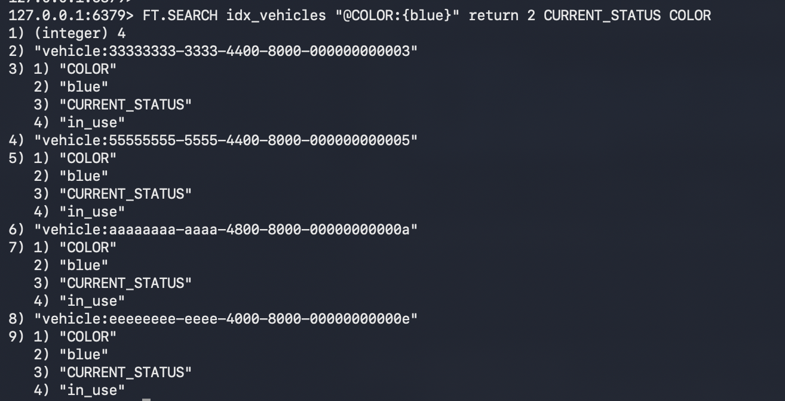

# FunWithDragonflyDB
A place to capture sample code and such

# Example 1: 
# This example uses CockroachDB as the system of record (as well as the source of changes propagated through a simple listener program to DragonFlyDB)


# It involves:
## 1. Capturing changes from CRDB (Cockroach Database) and writing them as JSON objects into DragonFlyDB
## 2. Then Searching DRagonflyDB for JSON objects (vehicles) of a particular color
## 3. Then updating one record in CockroachDB and searching DragonFlyDB again to see that the CDC has updated the searchable cache as well

# CD to the cdcJSONSearch folder
```
cd cdcJSONSearch
```

* Ensure you have Go installed
```
brew install go
```

** also install the redis go library:
```
go mod download github.com/redis/go-redis/v9

go get github.com/redis/go-redis/v9@v9.7.3
```

* Install DragonFlyDB
```
brew install dragonflydb
```

## To run DragonflyDB in a container you can use docker or podman:
* Install podman
```
brew install podman
```
* create a VM large enough to build cool stuff
```
podman machine init dragonfly --cpus 5 --memory 8192 --disk-size 20
```
* start a vm to use with DragonflyDB
```
podman machine start dragonfly
```
* start a containerized local instance of DragonFlyDB
```
podman --connection dragonfly run -p 6379:6379 --ulimit memlock=-1 docker.dragonflydb.io/dragonflydb/dragonfly &
```

## To connect on the command line use the redis cli
* install redis and the redis-cli
```
brew install redis
```
* start the redis-cli (it will use port 6379 by default)
```
redis-cli
```
* in the redis-cli shell: create a Search index to be used once we populate DragonFlyDB with JSON objects
```
FT.CREATE idx_vehicles ON JSON PREFIX 1 vehicle: SCHEMA $.after.city AS CURRENT_CITY TEXT $.after.current_location AS STREET_ADDRESS TEXT $.after.status AS CURRENT_STATUS TAG $.after.type AS VEHICLE_TYPE TAG $.after.ext.color AS COLOR TAG $.after.ext.brand AS BRAND TAG
```

* from the redis-cli interactive shell do:
```
dbsize
```

* Ensure you have CockroachDB installed:
```
brew install cockroachdb/tap/cockroach
```
## Start a local demo CRDB cluster with the demo movr app: 
* running cockroach demo starts an interactive session with the movr database:
```
cockroach demo
demo@127.0.0.1:26257/movr>
```
## Start the change feed for the vehicles table:
```
demo@127.0.0.1:26257/movr> CREATE CHANGEFEED FOR TABLE movr.vehicles INTO 'webhook-https://localhost:3000?insecure_tls_skip_verify=true' WITH updated; 
```

## Now we are ready to start the cdc_listener
*  Ensure you can execute the shell script:
in this project's directory:
```
chmod 755 start_cdc_listener.go
```
* start the cdc listener:
```
./start_cdc_listener.sh
```

## You should see a dump of JSON in the program terminal output and if you query dragonfly you will see the JSON objects now exist:

* Check for new onbjects in the cache by doing this from the redis-cli interactive shell:

```
dbsize
```

* Using the redis-cli Query for all blue vehicles:

```
FT.SEARCH idx_vehicles "@COLOR:{blue}" return 2 CURRENT_STATUS COLOR
```

## Showcase CDC in action again:

* Using the CRDB interactive shell (connected to the movr database) Query the current state of one vehicle record:

```
demo@127.0.0.1:26257/movr>
SELECT * FROM VEHICLES WHERE id='dddddddd-dddd-4000-8000-00000000000d';
```

* Using the CRDB interactive shell (connected to the movr database) update a record so the vehicle is now green:

```
demo@127.0.0.1:26257/movr> UPDATE VEHICLES SET ext=jsonb_set(ext, '{color}', '"red"') WHERE id = 'dddddddd-dddd-4000-8000-00000000000d';
```

## Back to the redis-cli to check that the CDC update was effective:


```
FT.SEARCH idx_vehicles "@COLOR:{blue}" return 2 CURRENT_STATUS COLOR
```


