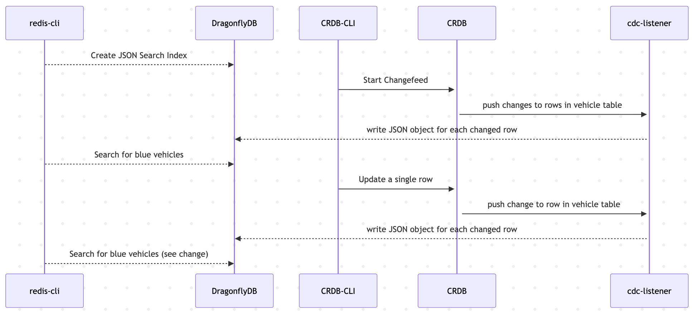
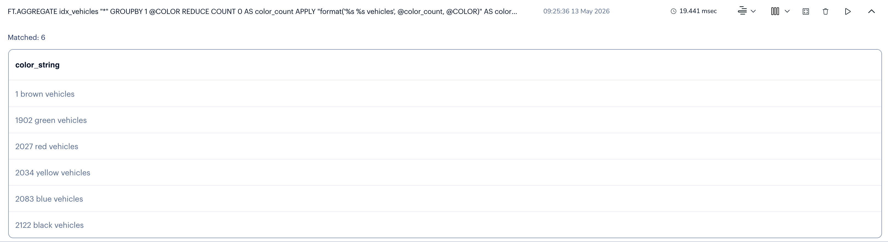

# FunWithDragonflyDB
A place to capture sample code and such

# Example 1: 
# This example showcases the use of the JSON/Search capabilities of DragonflyDB - It is designed to highlight the syncing of changes propagated through Change Data Capture (CDC). 

## This version uses a simple listener program that captures changes emitted from CockroachDB, converts them to JSON and writes them to DragonFlyDB.  

### A more robust example would use a highly available CDC solution such as https://debezium.io/documentation/reference/3.5/connectors/index.html

# The Flow: 



# It involves:
## 1. Capturing changes from CRDB (Cockroach Database) and writing them as JSON objects into DragonFlyDB
## 2. Then Searching DragonflyDB for JSON objects (vehicles) of a particular color
## 3. Then updating one record in CockroachDB and searching DragonFlyDB again to see that the CDC has updated the searchable cache as well

# CD to the cdcJSONSearch folder
```
cd cdcJSONSearch
```

* Ensure you have Go installed
```
brew install go
```

** also install the redis go library:
```
go mod download github.com/redis/go-redis/v9

go get github.com/redis/go-redis/v9@v9.7.3
```

* Install DragonFlyDB
```
brew install dragonflydb
```

## To run DragonflyDB in a container you can use docker or podman:
* Install podman
```
brew install podman
```
* create a VM large enough to build cool stuff
```
podman machine init dragonfly --cpus 5 --memory 8192 --disk-size 20
```
* start a vm to use with DragonflyDB
```
podman machine start dragonfly
```
* start a containerized local instance of DragonFlyDB
```
podman --connection dragonfly run -p 6379:6379 --ulimit memlock=-1 docker.dragonflydb.io/dragonflydb/dragonfly &
```

## To connect on the command line use the redis cli
* install redis and the redis-cli
```
brew install redis
```
* start the redis-cli (it will use port 6379 by default)
```
redis-cli
```
* in the redis-cli shell: create a Search index to be used once we populate DragonFlyDB with JSON objects
```
FT.CREATE idx_vehicles ON JSON PREFIX 1 vehicle: SCHEMA $.after.city AS CURRENT_CITY TEXT $.after.current_location AS STREET_ADDRESS TEXT $.after.status AS CURRENT_STATUS TAG $.after.type AS VEHICLE_TYPE TAG $.after.ext.color AS COLOR TAG $.after.ext.brand AS BRAND TAG
```

* from the redis-cli interactive shell do:
```
dbsize
```

* Ensure you have CockroachDB installed:
```
brew install cockroachdb/tap/cockroach
```
## Start a local demo CRDB cluster with the demo movr app: 
* running cockroach demo starts an interactive session with the movr database:
```
cockroach demo --with-load --insecure
```
<details><summary>Expected Output:</summary>
<p>

```bash
#
# Welcome to the CockroachDB demo database!
#
# You are connected to a temporary, in-memory CockroachDB cluster of 1 node.
#
# This demo session will send telemetry to Cockroach Labs in the background.
# To disable this behavior, set the environment variable
# COCKROACH_SKIP_ENABLING_DIAGNOSTIC_REPORTING=true.
#
# Beginning initialization of the movr dataset, please wait...
#
# The cluster has been preloaded with the "movr" dataset
# (MovR is a fictional vehicle sharing company).
#
# Reminder: your changes to data stored in the demo session will not be saved!
#
# If you wish to access this demo cluster using another tool, you will need
# the following details:
#
#   - Connection parameters:
#      (webui)    http://127.0.0.1:8080
#      (cli)      cockroach sql --insecure -d movr
#      (sql)      postgresql://root@127.0.0.1:26257/movr?sslmode=disable
#   
# Server version: CockroachDB CCL v26.1.3 (aarch64-apple-darwin21.2, built 2026/04/16 16:55:46, go1.25.5) (same version as client)
# Cluster ID: 0349e893-3913-4315-aa77-ebf5193ec936
# Organization: Cockroach Demo
#
# Enter \? for a brief introduction.
#
root@127.0.0.1:26257/movr>
```
</p>
</details>

## Start the change feed for the vehicles table:
```
demo@127.0.0.1:26257/movr> CREATE CHANGEFEED FOR TABLE movr.vehicles INTO 'webhook-https://localhost:3000?insecure_tls_skip_verify=true' WITH updated; 
```

## Now we are ready to start the cdc_listener
*  Ensure you can execute the shell script:
in this project's cdcJSONSearch directory:

```
chmod 755 start_cdc_listener.go
```

* start the cdc listener:

```
./start_cdc_listener.sh
```

<details><summary>Expected Output:</summary>
<p>

```bash
.....+...+...+..+.........+++++++++++++++++++++++++++++++++++++++++++++*.+..........+............+++++++++++++++++++++++++++++++++++++++++++++*......+............+...+...+..............+...+...................+.....+...................+..+.......+...........+.+.....+....+..+...+............+....+..................+++++
............+..+.............+...+.....+....+...+..+.+..+...............+....+...+++++++++++++++++++++++++++++++++++++++++++++*..+.....+...+..........+..+....+...........+.......+............+.....+...+...............+++++++++++++++++++++++++++++++++++++++++++++*......+..............+...+.+..+++++
-----
2026/05/07 14:43:17 Connected to DragonflyDB using: Redis<localhost:6379 db:0>
2026/05/07 14:43:17 starting server on port 3000
2026/05/07 14:43:17 {"payload":[{"after": {"city": "rome", "creation_time": "2019-01-02T03:04:05", "current_location": "63773 Sean Branch", "ext": {"brand": "Santa Cruz", "color": "black"}, "id": "50664625-5628-4c43-a10f-07629f613444", "owner_id": "f0a3d70a-3d70-4000-8000-00000000002f", "status": "available", "type": "bike"}, "key": ["rome", "50664625-5628-4c43-a10f-07629f613444"], "topic": "vehicles", "updated": "1778182996245065000.0000000000"}],"length":1}
2026/05/07 14:43:17 

data.Payload = [{{rome 2019-01-02T03:04:05 63773 Sean Branch {Santa Cruz black} 50664625-5628-4c43-a10f-07629f613444 f0a3d70a-3d70-4000-8000-00000000002f available bike} [rome 50664625-5628-4c43-a10f-07629f613444] vehicles 1778182996245065000.0000000000}]
2026/05/07 14:43:17 wrote 1/1 items to DragonflyDB
2026/05/07 14:43:19 {"payload":[{"after": {"city": "paris", "creation_time": "2019-01-02T03:04:05", "current_location": "49854 Nancy Road Apt. 18", "ext": {"brand": "Santa Cruz", "color": "black"}, "id": "96535cb1-27e6-472e-9156-5c790671b0e0", "owner_id": "1428ff9f-8c91-4566-8220-a4034f868c95", "status": "available", "type": "bike"}, "key": ["paris", "96535cb1-27e6-472e-9156-5c790671b0e0"], "topic": "vehicles", "updated": "1778182999966709000.0000000000"}],"length":1}
2026/05/07 14:43:19 

data.Payload = [{{paris 2019-01-02T03:04:05 49854 Nancy Road Apt. 18 {Santa Cruz black} 96535cb1-27e6-472e-9156-5c790671b0e0 1428ff9f-8c91-4566-8220-a4034f868c95 available bike} [paris 96535cb1-27e6-472e-9156-5c790671b0e0] vehicles 1778182999966709000.0000000000}]
2026/05/07 14:43:19 wrote 1/1 items to DragonflyDB
2026/05/07 14:43:20 {"payload":[{"after": {"city": "rome", "creation_time": "2019-01-02T03:04:05", "current_location": "97968 Robin Island Apt. 65", "ext": {"color": "green"}, "id": "5f00ff12-8e55-4e58-8e8f-eef2efde5d06", "owner_id": "4369c870-b2fc-43ef-9469-cd170737e344", "status": "available", "type": "skateboard"}, "key": ["rome", "5f00ff12-8e55-4e58-8e8f-eef2efde5d06"], "topic": "vehicles", "updated": "1778183000244474000.0000000000"}],"length":1}
2026/05/07 14:43:20 

data.Payload = [{{rome 2019-01-02T03:04:05 97968 Robin Island Apt. 65 { green} 5f00ff12-8e55-4e58-8e8f-eef2efde5d06 4369c870-b2fc-43ef-9469-cd170737e344 available skateboard} [rome 5f00ff12-8e55-4e58-8e8f-eef2efde5d06] vehicles 1778183000244474000.0000000000}]
2026/05/07 14:43:20 wrote 1/1 items to DragonflyDB
2026/05/07 14:43:29 {"payload":[{"after": {"city": "washington dc", "creation_time": "2019-01-02T03:04:05", "current_location": "60698 Ashley Plaza", "ext": {"color": "blue"}, "id": "717018bc-c38a-4aa3-9539-ccf8dc377a98", "owner_id": "da73483c-5d49-48dd-b139-fe47d750218d", "status": "available", "type": "scooter"}, "key": ["washington dc", "717018bc-c38a-4aa3-9539-ccf8dc377a98"], "topic": "vehicles", "updated": "1778183009965660000.0000000000"}],"length":1}
2026/05/07 14:43:29 

data.Payload = [{{washington dc 2019-01-02T03:04:05 60698 Ashley Plaza { blue} 717018bc-c38a-4aa3-9539-ccf8dc377a98 da73483c-5d49-48dd-b139-fe47d750218d available scooter} [washington dc 717018bc-c38a-4aa3-9539-ccf8dc377a98] vehicles 1778183009965660000.0000000000}]
2026/05/07 14:43:29 wrote 1/1 items to DragonflyDB
2026/05/07 14:43:37 {"payload":[{"after": {"city": "los angeles", "creation_time": "2019-01-02T03:04:05", "current_location": "54851 David Knolls Apt. 2", "ext": {"color": "black"}, "id": "e933bd2a-d761-4221-824f-ec544d3acfc2", "owner_id": "605bad70-6208-43e7-9219-1eb47611f4dc", "status": "in_use", "type": "skateboard"}, "key": ["los angeles", "e933bd2a-d761-4221-824f-ec544d3acfc2"], "topic": "vehicles", "updated": "1778183017964585000.0000000000"}],"length":1}
2026/05/07 14:43:37 

data.Payload = [{{los angeles 2019-01-02T03:04:05 54851 David Knolls Apt. 2 { black} e933bd2a-d761-4221-824f-ec544d3acfc2 605bad70-6208-43e7-9219-1eb47611f4dc in_use skateboard} [los angeles e933bd2a-d761-4221-824f-ec544d3acfc2] vehicles 1778183017964585000.0000000000}]
2026/05/07 14:43:37 wrote 1/1 items to DragonflyDB
2026/05/07 14:43:40 {"payload":[{"after": {"city": "amsterdam", "creation_time": "2019-01-02T03:04:05", "current_location": "83247 Wallace View Apt. 42", "ext": {"brand": "Schwinn", "color": "blue"}, "id": "6ad8fa2c-9eb1-4fdd-8c08-eab77acf1cee", "owner_id": "ae147ae1-47ae-4800-8000-000000000022", "status": "in_use", "type": "bike"}, "key": ["amsterdam", "6ad8fa2c-9eb1-4fdd-8c08-eab77acf1cee"], "topic": "vehicles", "updated": "1778183020129929000.0000000000"}],"length":1}
2026/05/07 14:43:40 

data.Payload = [{{amsterdam 2019-01-02T03:04:05 83247 Wallace View Apt. 42 {Schwinn blue} 6ad8fa2c-9eb1-4fdd-8c08-eab77acf1cee ae147ae1-47ae-4800-8000-000000000022 in_use bike} [amsterdam 6ad8fa2c-9eb1-4fdd-8c08-eab77acf1cee] vehicles 1778183020129929000.0000000000}]
2026/05/07 14:43:40 wrote 1/1 items to DragonflyDB

```
</p>
</details>


## You should see a periodic dump of JSON in the program terminal output and if you query dragonfly you will see the JSON objects now exist:

* Check for new objects in the cache by doing this from the redis-cli interactive shell:

```
dbsize
```

* Using the redis-cli Query for all vehicles by color:

```
FT.AGGREGATE idx_vehicles "*" GROUPBY 1 @COLOR REDUCE COUNT 0 AS color_count APPLY "format('%s %s vehicles', @color_count, @COLOR)" AS color_string GROUPBY 1 @color_string SORTBY 2 @color_string ASC
```
<details><summary>Expected Output:</summary>
<p>

```bash
1) (integer) 5
2) 1) "color_string"
   2) "1886 green vehicles"
3) 1) "color_string"
   2) "2009 red vehicles"
4) 1) "color_string"
   2) "2015 yellow vehicles"
5) 1) "color_string"
   2) "2068 blue vehicles"
6) 1) "color_string"
   2) "2106 black vehicles"
```
</p>
</details>


## Showcase CDC in action again:

* Using the CRDB interactive shell (connected to the movr database) Query the current state of one vehicle record:

```
demo@127.0.0.1:26257/movr>
SELECT * FROM VEHICLES WHERE id='dddddddd-dddd-4000-8000-00000000000d';
```
<details><summary>Expected Output:</summary>
<p>

```bash
                   id                  | city  | type |               owner_id               |    creation_time    | status |    current_location    |                 ext
---------------------------------------+-------+------+--------------------------------------+---------------------+--------+------------------------+---------------------------------------
  dddddddd-dddd-4000-8000-00000000000d | paris | bike | d1eb851e-b851-4800-8000-000000000029 | 2019-01-02 03:04:05 | in_use | 35426 Jordan Mountains | {"brand": "Merida", "color": "black"}
(1 row)

Time: 6ms total (execution 6ms / network 0ms)
```
</p>
</details>

* Using the CRDB interactive shell (connected to the movr database) update a record so the vehicle is now brown:

```
demo@127.0.0.1:26257/movr> UPDATE VEHICLES SET ext=jsonb_set(ext, '{color}', '"brown"') WHERE id = 'dddddddd-dddd-4000-8000-00000000000d';
```

## Back to the redis-cli to check that the CDC update was effective:


```
FT.AGGREGATE idx_vehicles "*" GROUPBY 1 @COLOR REDUCE COUNT 0 AS color_count APPLY "format('%s %s vehicles', @color_count, @COLOR)" AS color_string GROUPBY 1 @color_string SORTBY 2 @color_string ASC
```
<details><summary>Expected Output:</summary>
<p>

```bash
1) (integer) 6
2) 1) "color_string"
   2) "1 brown vehicles"
3) 1) "color_string"
   2) "1893 green vehicles"
4) 1) "color_string"
   2) "2011 red vehicles"
5) 1) "color_string"
   2) "2020 yellow vehicles"
6) 1) "color_string"
   2) "2071 blue vehicles"
7) 1) "color_string"
   2) "2108 black vehicles"
   ```
</p>
</details>

## Look at the latency for such a query against local DragonflyDB:
* execute multi/time/command/time/execute to see the time taken for the command
* subtract the first time from the second time to see how many microseconds it took

START_TIME:
1778176857 <-- seconds since epoch as known to DragonflyDB

247000 <-- microseconds after the last measured second in above measure

END_TIME:
1778176857 <-- seconds since epoch as known to DragonflyDB

247000 <-- microseconds after the last measured second in above measure

<details><summary>Sample Commands and Output:</summary>
<p>

```bash

127.0.0.1:6379> multi
OK
127.0.0.1:6379(TX)> time
QUEUED
127.0.0.1:6379(TX)> FT.AGGREGATE idx_vehicles "*" GROUPBY 1 @COLOR REDUCE COUNT 0 AS color_count APPLY "format('%s %s vehicles', @color_count, @COLOR)" AS color_string GROUPBY 1 @color_string SORTBY 2 @color_string ASC
QUEUED
127.0.0.1:6379(TX)> time
QUEUED
127.0.0.1:6379(TX)> exec
1) 1) (integer) 1778656666
   2) (integer) 370000
2) 1) (integer) 6
   2) 1) "color_string"
      2) "1 brown vehicles"
   3) 1) "color_string"
      2) "1895 green vehicles"
   4) 1) "color_string"
      2) "2014 red vehicles"
   5) 1) "color_string"
      2) "2023 yellow vehicles"
   6) 1) "color_string"
      2) "2073 blue vehicles"
   7) 1) "color_string"
      2) "2111 black vehicles"
3) 1) (integer) 1778656666
   2) (integer) 370000
```
</p>
</details>

### OR USE REDIS INSIGHT:


