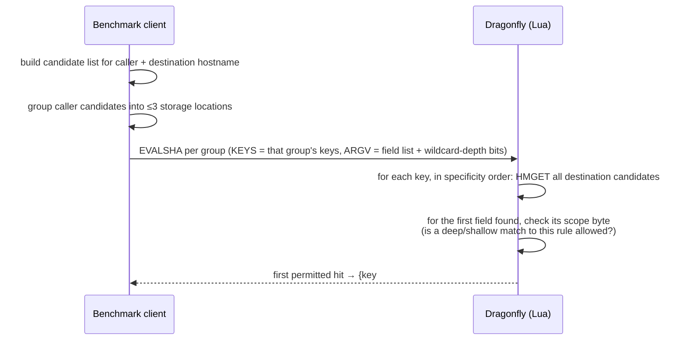
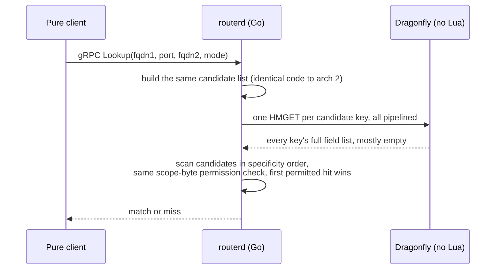

# Bucketing and the Lua-vs-routerd split, explained

Covers `go-benchmark/` (architecture 2: Go client talking directly to Dragonfly
with a Lua script) and `go-router-service/` (architecture 3: the same Go
client talking to a stateless `routerd` microservice fleet that talks to
Dragonfly with plain commands, no Lua). Citations are `file:line` against
this repo.

---

## 1. The bucketing argument: how `-num-buckets` distributes keys across the keyspace

**Short answer:** The
number you should picture (~8,000 slots per thread when N=2) describes
something Dragonfly does on its own, to its *whole* keyspace, independent of
this flag. `-num-buckets` doesn't carve that space up — it exploits an
already-existing division to fix one specific hot-key problem. Here's the
full mechanism.

### The problem bucketing solves

A lookup for `(fqdn1, port, fqdn2)` checks candidate patterns in three tiers,
each stored as its own Redis/Dragonfly key:

- **apex tier** — one key per registrable domain, e.g. `r:{ns:dragonfly42.com}:*.dragonfly42.com:443`
- **per-TLD tier** — one key per TLD, e.g. `r:{ns:__tld__:com}:*.com:443`
- **global tier** — exactly one key, ever: `r:{ns:__global__}:*:443`

The apex tier naturally spreads itself — with 10,000 synthetic domains in the
benchmark (`go-benchmark/main.go:28`), that's up to 10,000 distinct keys, so
apex traffic already lands all over the keyspace. But the TLD and global
tiers are checked on **every single lookup, regardless of which domain is
being queried** (`go-benchmark/pattern.go:118-121`):

> "True for the global and per-TLD tiers, the tiers checked on every lookup
> regardless of which domain is queried, and so the ones that need bucketed
> replication. The apex tier already spreads across one key per registrable
> domain and must never be bucketed."

Without bucketing, that means 100% of lookups — no matter how much client
concurrency you throw at it — repeatedly hit the *same one or two physical
keys*, and therefore the same one or two Dragonfly threads. `HOWTORUN.md`
(the Python-side design doc this Go code was ported from) states the
consequence explicitly:

> "On a real multi-threaded Dragonfly server this concentrates a
> disproportionate share of CPU onto the one or two threads that own those
> fixed keys, capping throughput no matter how much client concurrency you
> throw at it, since Dragonfly shards keys across its own threads and a
> given key is only ever served by the thread that owns it."

(That hot-key hypothesis was tested empirically in a sibling diagnostic
script before this code was written, `diagnose_hot_tag_routing.py` — worth
flagging that a follow-up diagnostic, `diagnose_router_hotspot.py`, found the
first measurement was partly a pipelining artifact and re-ran it against a
more realistic workload; no result of that re-run is written down anywhere
in the repo, so treat "this is definitely the bottleneck" as the working
hypothesis the code was built around, not a proven fact.)

### The fix: replicate the two hot keys, route reads deterministically

`-num-buckets N` turns each of those two single keys into `N` physical
replica keys instead — `r:{ns:__global__:0}:*:443` ... `r:{ns:__global__:15}:*:443`
for the default `N=16`. This happens in two places:

**Write side — fan out to every replica.** `keysForPattern`
(`go-benchmark/router.go:160-170`, byte-identical at
`go-router-service/store.go:101-111`) returns all `N` keys for a global/TLD
pattern; `Put`/`PutMany` write the same rule into every one of them in one
pipeline (`router.go:176-192`, `:197-220`). So every bucket holds an
identical copy of the catch-all rule set.

**Read side — pick exactly one, deterministically, by hashing the query
itself.** This is the part worth sitting with, because it's the actual
"bucketing argument" — the mechanism that makes routing deterministic rather
than random per request:

```go
// pattern.go:149-153
bucketIndex := 0
if numBuckets > 1 {
    bucketIndex = int(crc32.ChecksumIEEE([]byte(fqdn))) % numBuckets
}
```

Note what gets hashed: **the concrete query fqdn, not the pattern.** The
patterns themselves (`"*"`, `"*.com"`) are fixed strings — hashing them would
pick the same bucket every time and accomplish nothing. Hashing the query
means: the same fqdn always lands on the same bucket, on every process, with
zero coordination between them — that's the determinism. Different fqdns
scatter pseudo-randomly across `0..N-1`.

That `bucketIndex` gets folded into the key's hash tag —
`bucketedTag(baseTag, numBuckets, bucketIndex)` = `"<baseTag>:<bucketIndex>"`
(`pattern.go:126-131`) — and the hash tag is exactly the substring inside the
`{ }` braces in the physical key name (`router.go:148-150`):

```go
r:{<namespace>:<tag>}:<pattern>:<port>
```

Redis Cluster / Dragonfly hash *only the bytes inside the braces* to pick a
slot (the standard hash-tag mechanism the multi-key `EVALSHA` in arch 2
depends on to keep all its `KEYS` co-located — see §3). So appending
`:<bucketIndex>` to the tag changes which slot that replica's key lands on.

What `-num-buckets` controls is how many of those
*already-existing* thread-owned regions the two permanently-hot catch-all
keys get smeared across, instead of both of them pinning to whichever single
region they happened to hash into. Two buckets make the always-checked catch-all lookup land in two different
*pre-existing* regions across the query population, roughly 50/50, instead
of 100% in one. That's why the guidance is to set `-num-buckets` to the
server's *actual* thread count (`go-benchmark/README.md:69`,
`RecommendedNumBuckets` at `router.go:398-415`) — matching bucket count to
thread count is what makes "N buckets" line up with "N regions to spread
across," rather than under- or over-shooting it.

### The consistency guard

Because writers and readers must agree on `N` (a reader using a different
`N` than the writer would hash to the wrong replica and see the catch-all
tier as empty), both `NewRuleStore` and `NewNoScriptRuleStore` unconditionally
check a recorded bucket count on startup and refuse to proceed on mismatch
(`router.go:112-146`, `store.go:57-87`) — checked even when `numBuckets == 1`,
specifically so "a reader left at the default against a namespace some other
writer already bucketed" fails loudly instead of silently missing every
catch-all rule (`router.go:122-126`).

---

## 2. Compute load: client/benchmark machine vs. Dragonfly, with and without routerd

Two architectures answer the exact same `Lookup(fqdn1, port, fqdn2, mode)`
call, behind one shared interface (`Lookuper`, `go-benchmark/lookuper.go:21-23`).
`-target direct` uses arch 2; `-target grpc=host:port[,...]` uses arch 3.

### Without routerd (`-target direct`, arch 2)

The benchmark process itself does essentially all the CPU work:

1. Normalize both fqdns, validate the port (`router.go:256-266`).
2. Generate the full candidate list for **both** fqdn1 and fqdn2 —
   including a `crc32.ChecksumIEEE` hash for each — via `candidates()`
   (`router.go:268-269`).
3. Group the fqdn1 candidates by hash tag (`router.go:276-284`) — at most 3
   groups, since that's structurally the max distinct tags a query can
   touch.
4. Build the Lua `EVALSHA` arguments (bit-strings encoding which candidates
   need "deep" wildcard permission) and dispatch one `EVALSHA` per group,
   all inside a single pipeline — **one network round trip**
   (`router.go:286-299`).
5. Once results come back, reconcile the (at most 3) per-group winners into
   one overall winner client-side (`moreSpecific`, `router.go:342-347`).

Dragonfly's job, per group: run the Lua interpreter, loop over that group's
keys doing `HMGET`, and **stop at the first permitted hit** — later keys in
that group are never even fetched (`router.go:59-61`). The response is a
compact `{keyIndex, fieldIndex, ruleID}` triple or nothing, per group — O(1)
regardless of dataset size.

### With routerd (`-target grpc=...`, arch 3)

The benchmark process does almost none of that:

```go
// lookuper.go:66-89, the entire client-side cost
idx := int(l.next.Add(1)-1) % len(l.clients)   // round-robin pick
resp, err := l.clients[idx].Lookup(l.ctx, &pb.LookupRequest{...})  // one RPC, 4 scalars
```

No normalization, no candidate generation, no hashing, no key construction,
no ranking. All of that moves into `routerd` — a separate, independently
scalable Go process (or fleet of them) — which then runs the *exact same*
candidate-generation code (`store.go:220-225`, literally the same
`pattern.go` file, copied unmodified into both trees) before doing its own
lookup against Dragonfly: one plain `HMGET` per fqdn1 candidate, all in one
pipeline, no Lua (`store.go:227-235`), then a flat scan in Go for the first
permitted hit (`store.go:237-262`).

### The actual trade, precisely

| | Arch 2 (direct, Lua) | Arch 3 (grpc, routerd) |
|---|---|---|
| Where candidate generation / hashing / ranking runs | benchmark client process | routerd process |
| Network hops | 1 (client ↔ Dragonfly) | 2 (client ↔ routerd, routerd ↔ Dragonfly), serialized |
| Commands Dragonfly sees on the wire | ≤3 `EVALSHA` | up to `len(aCandidates)` `HMGET` — typically 3-6, worst case ~21 at `maxLabels=20` |
| Response payload | O(1) per group | O(aCandidates × bCandidates) field values, mostly nil |
| Server-side early exit | yes — Lua stops at first hit | no — every pipelined HMGET is dispatched and returned before Go even looks at the results |
| Dragonfly CPU character | Lua interpreter overhead, but fewer ops actually executed thanks to early exit | no interpreter, but no early exit either — every declared command runs |
| Who can scale independently | nobody — client and Dragonfly are the only two tiers | routerd — add replicas without touching Dragonfly's thread count or the client's own concurrency |

One correction worth making explicit, because it's easy to misread the
project's own README table on this point: **"≤3 Dragonfly-side commands" for
arch 2 counts only what crosses the wire as `EVALSHA` calls.** Inside the
Lua script, Dragonfly is still doing up to `len(aCandidates)` internal
`HMGET`s via `redis.call` (`router.go:52`) — the same number arch 3 sends
explicitly. The real difference isn't "fewer HMGETs happen," it's that (a)
arch 2's HMGETs never leave Dragonfly, so they cost no wire/serialization
overhead, and (b) arch 2 stops at the first hit while arch 3, having already
committed to sending every HMGET eagerly in one pipeline, cannot cancel any
of them once dispatched.

Also worth knowing if you're setting up a true architecture comparison: even
under `-target grpc=...`, the benchmark process still opens a direct Redis
connection and loads the Lua script (`main.go:765`, reached unconditionally),
because the write phase always goes straight to Dragonfly regardless of
`-target` — routerd has no write RPC, by design (`main.go:797-800`). So a
benchmark run in "arch 3 mode" is not itself a pure decoupled client; only
the *query* phase is decoupled. A genuinely credential-free pure client only
exists once you write your data some other way and run nothing but the
query phase against `routerd`.

---

## 3. The matching logic: Lua vs. routerd, in plain terms

### What the system is actually deciding

Think of it as a firewall/routing policy lookup: given a request described
by *(who's calling in, what port, who they want to reach)*, find the single
rule that governs it. Rules can be written narrowly (an exact hostname pair)
or broadly with wildcards (`*.example.com` — "any subdomain of example.com",
or even the bare `*` — "anyone, from anywhere"). When more than one rule
could apply to the same request, the most specific one wins — the same
principle as CSS specificity, or firewall rules evaluated most-specific-first.

To answer that without scanning every rule ever registered, the code
precomputes, for one incoming request, the ordered list of every pattern
that *could* match it — from the literal exact hostname down to the loosest
wildcard — for both the caller's hostname and the destination's hostname.
That candidate list, and the tiered/bucketed key layout from §1, is the same
in both architectures (`pattern.go`, unmodified between the two repos). What
differs is who evaluates it and where.

### Arch 2's Lua script: a dumb index lookup, on purpose

The design goal is stated directly in the sibling Python project's docstring:
"The Lua script holds no matching policy" — all matching *rules* live in
plain Go/Python (`pattern.go`), testable with zero Redis involved. Lua's
job is mechanical:



Concretely, per storage location, in specificity order: fetch every
destination-hostname candidate's stored value in one shot (`HMGET`); for each
value that exists, check whether the *rule itself* declared it's reachable
this way — a rule can restrict its own wildcard to match only one level deep
(`*.example.com` matches `foo.example.com` but not `foo.bar.example.com`),
only multiple levels deep, or both. That's the `'S'`/`'M'`/`'B'` scope byte
stored with every rule. The very first permitted hit, in specificity order,
wins and the script returns immediately — it never even looks at looser
candidates once it's found a permitted match. Only that one small pointer
crosses the network back to the client, which is what keeps the response
O(1) regardless of how many rules exist.

### routerd's Go version: same business rule, moved out of the database



Same precomputed candidate list, same "first permitted hit in specificity
order wins" business rule, same scope-byte check — just moved from inside
Dragonfly's Lua interpreter into routerd's own Go code, evaluated *after*
every candidate's data has already come back rather than short-circuiting
mid-fetch. The grouping-by-storage-location step from arch 2 disappears
entirely here, because that grouping only existed to satisfy Lua's multi-key
`EVALSHA` slot restriction — a restriction that doesn't apply to `HMGET`,
which is a single-key command with no such constraint
(`store.go:198-206`).

### Why build routerd as a separate thing at all — the business decision

The project's own README frames this plainly as a controlled experiment,
not a drop-in replacement, and states the open question it exists to answer:

> "The central, falsifiable question this architecture exists to answer:
> whether the O(1) -> O(n×m) blowup in Dragonfly-side commands and response
> bytes (traded for zero Lua, decoupled callers, and independently scalable
> compute) is a net win or a net loss at realistic query concurrency, and
> whether it's the extra network hop or the extra payload that dominates p99
> once measured." (`go-router-service/README.md:111-115`)

Three concrete business tradeoffs motivate testing it:

- **Decoupling.** A pure client talking to `routerd` never needs Dragonfly
  credentials, connection settings, or any knowledge of the wildcard-matching
  scheme — it asks a yes/no question over gRPC with three scalars. That
  matters if you want to expose lookups to callers you don't want holding
  raw database access.
- **Independent scaling.** Lua-side compute is bound to whichever Dragonfly
  thread owns the relevant key — you can't add matching capacity without
  adding Dragonfly threads. `routerd` replicas are stateless
  (`go-router-service/cmd/routerd/main.go:1-7`: "no local cache, no
  in-memory rule state ... that statelessness is the architecture under
  test; adding a cache here would confound it"), so you can scale the
  matching tier by adding machines, independent of both the caller fleet and
  Dragonfly itself.
- **Operational simplicity vs. wire cost.** Removing Lua removes script
  load/version/`NOSCRIPT`-on-restart handling, at the cost of more commands
  per lookup and a response payload that's mostly "nothing here" rather than
  one compact answer.

Whether that trade actually pays off is explicitly **not settled anywhere in
this repository** — no benchmark output or measured comparison exists in
either tree. The tracing behind this document found the question posed, and
the machinery built to answer it, but no recorded answer.

---

## Loose ends worth knowing about

Found while tracing the code for this document — none of these change the
explanations above, but they're the kind of thing that bites you later:

- **The destination-hostname (`fqdn2`) side computes a bucket hash it never
  uses.** Both `Lookup` implementations call `candidates()` on `fqdn2` too,
  which runs the same `crc32` bucket-index computation — but only `.Pattern`
  and `.NeedsMulti` are ever read from those candidates; the tag/bucket is
  wasted work on every single lookup, in both architectures.
- **A rule stored as exact-hostname-to-exact-hostname with `Scope: ScopeMulti`
  is unreachable.** The scope check treats an exact-exact match as "shallow"
  (`deep = false`), which blocks `'M'`-scoped rules by design — so that
  specific combination can never match, in either architecture.
- **`routerd` defaults to namespace `"default"`; the benchmark writes under
  `"bench"`** (`cmd/routerd/main.go:37` vs `main.go:765`). Run `routerd`
  without explicitly passing `-namespace bench` and every lookup silently
  returns a clean miss — the bucket-count consistency guard doesn't catch
  this, because it passes vacuously against a namespace with no metadata key
  at all.
- **`RecommendedNumBuckets` is defined in both stores and called by neither**
  — it's a deployment-time sizing helper, deliberately not auto-invoked so a
  process restart can't silently change the layout underneath already-written
  data.
